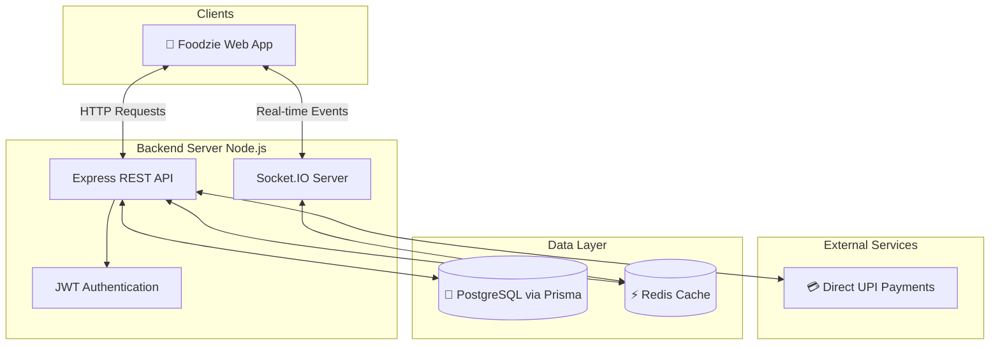

# Foodzie Backend 🚀⚙️

**Foodzie Server** is the robust backend API that powers the Foodzie campus food-ordering platform. It handles everything from user authentication and real-time order tracking to payment processing and database management, ensuring the entire ecosystem—students, vendors, delivery riders, and admins—runs smoothly.

---

## 📖 Overview

The Foodzie backend is built as a RESTful API using **Node.js** and **Express**, with strict typing provided by **TypeScript**. It utilizes **Prisma ORM** to interact with a PostgreSQL database, providing a deeply integrated and scalable data layer.

To support the high-velocity nature of food delivery, the backend leverages **Socket.IO** for instantaneous bi-directional communication (crucial for live GPS tracking and order status updates) and **Redis** for performant caching.

### 🏗️ System Architecture



---

## ✨ Key Features

- **Robust Authentication:** Secure JWT-based authentication and role-based access control (Admin, Vendor, Student, Delivery) to ensure endpoints are fully protected.
- **Real-Time WebSockets:** Integrated `socket.io` server broadcasts live location updates from delivery riders and pushes order status changes instantly to vendors and customers.
- **Payment Processing:** Supports Direct UPI transactions (Student to Vendor) alongside Cash on Delivery (COD) workflows.
- **Database Architecture:** Structured relational schemas mapped via Prisma ORM for Universities, Users, Food Items, Orders, Reviews, and Delivery analytics. Includes robust database seeding for testing and local development.
- **API Security:** Hardened with `express-rate-limit` to prevent abuse and protect platform stability.

---

## 🛠️ Technology Stack

This server is constructed using modern, scalable backend technologies:

<p align="center">
  <a href="https://nodejs.org/"></a>
  <a href="https://expressjs.com/"></a>
  <a href="https://www.typescriptlang.org/"></a>
  <a href="https://www.prisma.io/"></a>
  <a href="https://www.postgresql.org/"></a>
  <a href="https://socket.io/"></a>
  <a href="https://redis.io/"></a>
</p>

- **Runtime:** [Node.js](https://nodejs.org/)
- **Framework:** [Express.js](https://expressjs.com/)
- **Language:** [TypeScript](https://www.typescriptlang.org/)
- **ORM:** [Prisma](https://www.prisma.io/)
- **Database:** PostgreSQL (configured via Prisma)
- **Real-Time:** [Socket.IO](https://socket.io/)
- **Caching:** [Redis](https://redis.io/) (via `ioredis`)
- **Authentication:** JWT (`jsonwebtoken`) & `bcryptjs`

---

## 🚀 Getting Started

Follow these instructions to set up the backend locally.

### Prerequisites

Ensure you have the following installed:
- **Node.js** (v18 or newer recommended)
- **npm** or **yarn**
- **PostgreSQL** (running locally or via a cloud provider)
- **Redis** (running locally or via a cloud provider)

### Installation

1. **Install dependencies:**
   ```bash
   npm install
   ```

2. **Set up Environment Variables:**
   Duplicate the `.env.example` file and rename it to `.env`. Fill in your database URL, Redis URL, and JWT secrets.
   ```bash
   cp .env.example .env
   ```

3. **Database Migration & Generation:**
   Generate the Prisma client and run migrations to build the database schema.
   ```bash
   npx prisma generate
   npx prisma migrate dev
   ```

4. **(Optional) Seed the Database:**
   Populate your database with mock users, universities, and food items.
   ```bash
   npx prisma db seed
   ```

5. **Run the Development Server:**
   This will spin up the `ts-node-dev` server with hot reloading.
   ```bash
   npm run dev
   ```

6. **Access the API:**
   The server runs on [http://localhost:8000](http://localhost:8000) by default (or the port specified in your `.env`).

---

## 📁 Project Structure

```text
backend/
├── prisma/               # Prisma schema, migrations, and seed scripts
├── src/                  
│   ├── controllers/      # Route logic and request handlers
│   ├── routes/           # Express API route definitions
│   ├── middleware/       # JWT auth and rate limiting middleware
│   ├── lib/              # Utility functions and configurations
│   └── index.ts          # Server entry point and Socket.io setup
├── .env.example          # Template for environment variables
└── package.json          # Project dependencies and scripts
```

---

*Powering the future of campus dining.*
